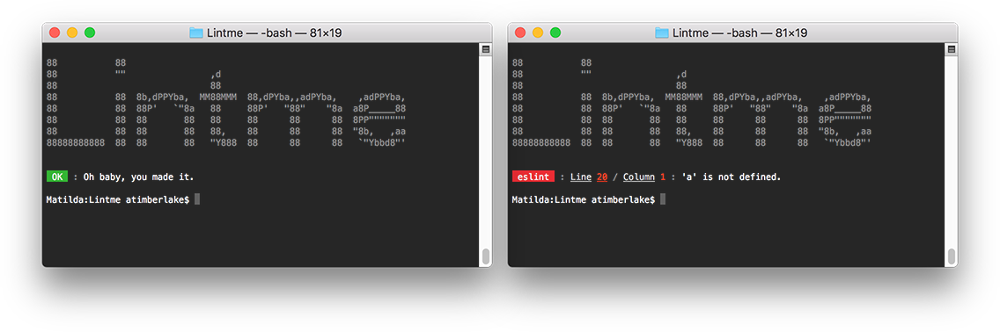

# Readlint

> Inline code block linting for the README generation.


&nbsp;

&nbsp;

&nbsp;

&nbsp;
[](https://github.com/prettier/prettier)

**npm**: `npm install readlint --save-dev`



## Getting Started

Using `readlint` is as easy as installing it, and then running it local to your project. There is no configuration as `eslint` and `stylelint` takes its configuration from their respective config files, which ideally should be the same as the config you're using for the entire project.

**`package.json`**

```json
{
    "scripts": {
        "lint": "eslint && stylelint && readlint"
    }
}
```

## Support Languages

| Language     | Linter      | Requires Configuration? |
| -------------| ----------- | ------------------------|
| `javascript` | `eslint`    | Yes                     |
| `css`        | `stylelint` | Yes                     |
| `json`       | `jsonlint`  | No                      |
| `html`       | `htmllint`  | Yes                     |
| `yaml`       | `yamllint`  | No                      |
| -------------| ----------- | ------------------------|
